# 📋 Executive Security Report

   

## 📊 Executive Summary

| Property | Value |
|----------|-------|
| Server Name | development\-assistant |
| Protocol Version | 2024\-11\-05 |
| Security Score | 0/100 |
| Quality Score | 100% |
| Report Date | 30/1/2026, 07:13:03 |

## 🔒 Security Findings

> 🟠 **Finding:** La herramienta "file\_operations" tiene el parámetro de ruta "path" sin patrón de validación

| Severity | Rule | Details |
|----------|------|----------|
| 🟠 High | SEC\-001 | tool:file\_operations |

<details>
<summary>🔧 Remediation</summary>

```bash
# Suggested Solution
Add a regex pattern to validate the "path" parameter. Example: "^[a-zA-Z0-9_/-]+.txt$" to allow only safe filenames.
```

</details>

---

> 🟠 **Finding:** La herramienta "code\_analysis" tiene el parámetro de ruta "file" sin patrón de validación

| Severity | Rule | Details |
|----------|------|----------|
| 🟠 High | SEC\-001 | tool:code\_analysis |

<details>
<summary>🔧 Remediation</summary>

```bash
# Suggested Solution
Add a regex pattern to validate the "file" parameter. Example: "^[a-zA-Z0-9_/-]+.txt$" to allow only safe filenames.
```

</details>

---

> 🟠 **Finding:** Resource "Project Files" has dynamic URI without documented restrictions

| Severity | Rule | Details |
|----------|------|----------|
| 🟠 High | SEC\-001 | resource:Project Files |

<details>
<summary>🔧 Remediation</summary>

```bash
# Suggested Solution
Ensure the server validates and sanitizes URI parameters. Consider using a whitelist of allowed paths or implementing strict input validation.
```

</details>

---

> 🔴 **Finding:** Inyección de Comandos Potencial: El parámetro "command" en la herramienta "execute\_command" carece de patrón de validación

| Severity | Rule | Details |
|----------|------|----------|
| 🔴 Critical | SEC\-002 | tool:execute\_command |

<details>
<summary>🔧 Remediation</summary>

```bash
# Suggested Solution
Implement a strict whitelist regex (e.g., ^[a-zA-Z0-9]+$) to prevent shell metacharacter injection.
```

</details>

---

> 🔴 **Finding:** Inyección de Comandos Potencial: El parámetro "tool" en la herramienta "code\_analysis" carece de patrón de validación

| Severity | Rule | Details |
|----------|------|----------|
| 🔴 Critical | SEC\-002 | tool:code\_analysis |

<details>
<summary>🔧 Remediation</summary>

```bash
# Suggested Solution
Implement a strict whitelist regex (e.g., ^[a-zA-Z0-9]+$) to prevent shell metacharacter injection.
```

</details>

---

> 🔴 **Finding:** Inyección de Comandos Potencial: El parámetro "file" en la herramienta "code\_analysis" carece de patrón de validación

| Severity | Rule | Details |
|----------|------|----------|
| 🔴 Critical | SEC\-002 | tool:code\_analysis |

<details>
<summary>🔧 Remediation</summary>

```bash
# Suggested Solution
Implement a strict whitelist regex (e.g., ^[a-zA-Z0-9]+$) to prevent shell metacharacter injection.
```

</details>

---

> 🔴 **Finding:** Inyección de Comandos Potencial: El parámetro "query" en la herramienta "database\_tools" carece de patrón de validación

| Severity | Rule | Details |
|----------|------|----------|
| 🔴 Critical | SEC\-002 | tool:database\_tools |

<details>
<summary>🔧 Remediation</summary>

```bash
# Suggested Solution
Implement a strict whitelist regex (e.g., ^[a-zA-Z0-9]+$) to prevent shell metacharacter injection.
```

</details>

---

> 🔴 **Finding:** Inyección de Comandos Potencial: El parámetro "database" en la herramienta "database\_tools" carece de patrón de validación

| Severity | Rule | Details |
|----------|------|----------|
| 🔴 Critical | SEC\-002 | tool:database\_tools |

<details>
<summary>🔧 Remediation</summary>

```bash
# Suggested Solution
Implement a strict whitelist regex (e.g., ^[a-zA-Z0-9]+$) to prevent shell metacharacter injection.
```

</details>

---

> 🟠 **Finding:** Potential SSRF: Parameter "repo" accepts URLs but lacks domain validation

| Severity | Rule | Details |
|----------|------|----------|
| 🟠 High | SEC\-003 | tool:git\_operations |

<details>
<summary>🔧 Remediation</summary>

```bash
# Suggested Solution
Restrict input to specific allowed domains using a strict regex pattern (e.g., ^https://api.example.com/).
```

</details>

---

> 🔴 **Finding:** Potential SQL Injection: Parameter "query" in tool "database\_tools" lacks validation pattern

| Severity | Rule | Details |
|----------|------|----------|
| 🔴 Critical | SEC\-007 | tool:database\_tools |

<details>
<summary>🔧 Remediation</summary>

```bash
# Suggested Solution
Use prepared statements with placeholders AND implement strict input validation (e.g., ^[a-zA-Z0-9_]+$ for identifiers).
```

</details>

---

> 🟠 **Finding:** Tool "database\_tools" executes SQL but doesn't mention using prepared statements or parameterized queries

| Severity | Rule | Details |
|----------|------|----------|
| 🟠 High | SEC\-007 | tool:database\_tools |

<details>
<summary>🔧 Remediation</summary>

```bash
# Suggested Solution
Update tool description to explicitly state use of prepared statements, ORMs, or query builders. Never concatenate user input into SQL strings.
```

</details>

---

> 🟡 **Finding:** Sensitive parameter "message" \(personal\) lacks format specification

| Severity | Rule | Details |
|----------|------|----------|
| 🟡 Medium | SEC\-010 | tool:git\_operations |

<details>
<summary>🔧 Remediation</summary>

```bash
# Suggested Solution
Set appropriate format (e.g., format: "password" for credentials, format: "email" for emails). Implement validation pattern.
```

</details>

---

> 🟡 **Finding:** Sensitive parameter "message" \(personal\) has no validation pattern

| Severity | Rule | Details |
|----------|------|----------|
| 🟡 Medium | SEC\-010 | tool:git\_operations |

<details>
<summary>🔧 Remediation</summary>

```bash
# Suggested Solution
Validate date formats (YYYY-MM-DD). Implement age range checks.
```

</details>

---

> 🟡 **Finding:** Sensitive parameter "package" \(personal\) lacks format specification

| Severity | Rule | Details |
|----------|------|----------|
| 🟡 Medium | SEC\-010 | tool:dependency\_manager |

<details>
<summary>🔧 Remediation</summary>

```bash
# Suggested Solution
Set appropriate format (e.g., format: "password" for credentials, format: "email" for emails). Implement validation pattern.
```

</details>

---

> 🟡 **Finding:** Sensitive parameter "package" \(personal\) has no validation pattern

| Severity | Rule | Details |
|----------|------|----------|
| 🟡 Medium | SEC\-010 | tool:dependency\_manager |

<details>
<summary>🔧 Remediation</summary>

```bash
# Suggested Solution
Validate date formats (YYYY-MM-DD). Implement age range checks.
```

</details>

---

> 🟡 **Finding:** Tool "file\_operations" performs file operations without rate limiting

| Severity | Rule | Details |
|----------|------|----------|
| 🟡 Medium | SEC\-011 | tool:file\_operations |

<details>
<summary>🔧 Remediation</summary>

```bash
# Suggested Solution
Implement rate limiting with the following guidelines:
- File uploads: 10 files per hour, max 10MB per file
- Implement upload quotas per user

Configuration options:
- Add x-rate-limit extension to tool schema
- Document rate limits in tool description
- Return 429 Too Many Requests with Retry-After header
```

</details>

---

> 🟡 **Finding:** Tool "dependency\_manager" performs database operations without rate limiting

| Severity | Rule | Details |
|----------|------|----------|
| 🟡 Medium | SEC\-011 | tool:dependency\_manager |

<details>
<summary>🔧 Remediation</summary>

```bash
# Suggested Solution
Implement rate limiting with the following guidelines:
- Database queries: 100 requests per minute per user
- Implement query result caching

Configuration options:
- Add x-rate-limit extension to tool schema
- Document rate limits in tool description
- Return 429 Too Many Requests with Retry-After header
```

</details>

---

> 🟡 **Finding:** Tool "database\_tools" performs database operations without rate limiting

| Severity | Rule | Details |
|----------|------|----------|
| 🟡 Medium | SEC\-011 | tool:database\_tools |

<details>
<summary>🔧 Remediation</summary>

```bash
# Suggested Solution
Implement rate limiting with the following guidelines:
- Database queries: 100 requests per minute per user
- Implement query result caching

Configuration options:
- Add x-rate-limit extension to tool schema
- Document rate limits in tool description
- Return 429 Too Many Requests with Retry-After header
```

</details>

---

> 🔴 **Finding:** Potential RCE capability detected in tool

| Severity | Rule | Details |
|----------|------|----------|
| 🔴 Critical | HEURISTIC | tool:execute\_command |

---

> 🟡 **Finding:** Filesystem modification detected in tool

| Severity | Rule | Details |
|----------|------|----------|
| 🟡 Medium | HEURISTIC | tool:file\_operations |

---

> 🔴 **Finding:** Potential RCE capability detected in tool

| Severity | Rule | Details |
|----------|------|----------|
| 🔴 Critical | HEURISTIC | tool:code\_analysis |

---

> 🟠 **Finding:** Credential/Auth handling detected in tool

| Severity | Rule | Details |
|----------|------|----------|
| 🟠 High | HEURISTIC | tool:environment\_manager |

---

> 🔴 **Finding:** Potential RCE capability detected in tool

| Severity | Rule | Details |
|----------|------|----------|
| 🔴 Critical | HEURISTIC | tool:database\_tools |

---

> 🟡 **Finding:** Database operations detected in tool

| Severity | Rule | Details |
|----------|------|----------|
| 🟡 Medium | HEURISTIC | tool:database\_tools |

---

## 🛠️ Capabilities Overview

- **execute\_command**
  - Description: Execute shell commands \(git, npm, docker, etc\.\)
  - Status: Valid
- **file\_operations**
  - Description: Read, write, or search files
  - Status: Valid
- **git\_operations**
  - Description: Perform git operations \(clone, commit, push, config\)
  - Status: Valid
- **dependency\_manager**
  - Description: Install or update npm/pip packages
  - Status: Valid
- **code\_analysis**
  - Description: Run linters, formatters, and complexity analysis
  - Status: Valid
- **ai\_code\_assistant**
  - Description: AI\-powered code completion and refactoring
  - Status: Valid
- **environment\_manager**
  - Description: Manage environment variables and secrets
  - Status: Valid
- **database\_tools**
  - Description: Execute queries on development database
  - Status: Valid

### Tools

| Tool | Valid | Description |
|------|-------|-------------|
| execute\_command | Valid | Execute shell commands \(git, npm, docker, etc\.\) |
| file\_operations | Valid | Read, write, or search files |
| git\_operations | Valid | Perform git operations \(clone, commit, push, confi\.\.\. |
| dependency\_manager | Valid | Install or update npm/pip packages |
| code\_analysis | Valid | Run linters, formatters, and complexity analysis |
| ai\_code\_assistant | Valid | AI\-powered code completion and refactoring |
| environment\_manager | Valid | Manage environment variables and secrets |
| database\_tools | Valid | Execute queries on development database |

## 📈 Architecture Diagram

```mermaid
graph LR
    A["🖥️ Client"] -->|MCP Protocol| B["🌐 Transport"]
    B -->|2024-11-05| C["🔐 Server: development-assistant"]
    C -->|8 Tools| D["⚙️ Functionality"]
    C -->|0% Security| E["🛡️ Safety Layer"]
```



## ✅ Protocol Compliance

**Protocol Compliance:** `████████████████████ 100%`

| Standard | Status |
|----------|--------|
| Protocol Spec | ✅ Passed |
| Schema Valid | ✅ Passed |

---

**Report generated by:** [mcp-verify](https://github.com/FinkTech/mcp-verify) CLI
**Report Date:** 30/1/2026, 07:13:03
**Tools Total:** 8
**Security Findings:** 24
